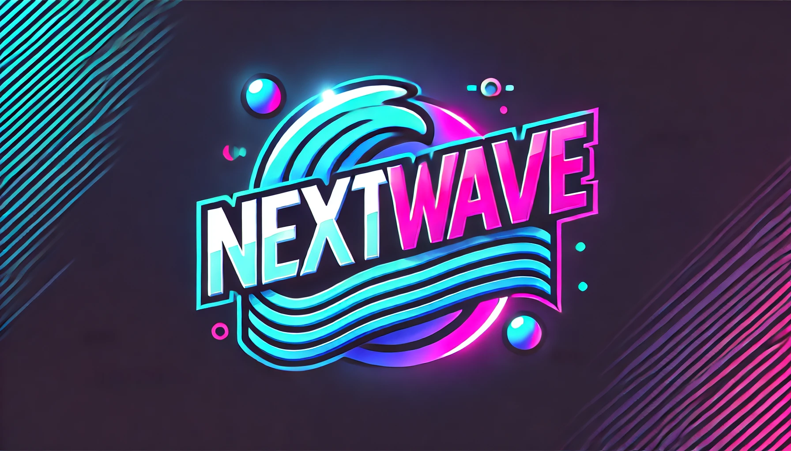

# 👨‍💻 Joshua Bruner (JoshTheCyberSecuritySpecialist)

**Cybersecurity Professional | Software Developer | Linux Enthusiast**

Welcome to my GitHub profile! I'm Joshua Bruner, a cybersecurity specialist based in Orlando, Florida. I have a passion for securing systems, developing efficient software solutions, and exploring the depths of Linux.

---

## 🔧 Technologies & Tools

- **Languages**:   
- **Frameworks**:   
- **Tools**:   
- **Databases**: 

---

## 🛠️ Notable Projects

- **[Security-Testing-Lab](https://github.com/JoshTheCyberSecuritySpecialist/Security-Testing-Lab)**: A repository containing security testing and penetration testing exercises, including analysis of vulnerabilities in OWASP Juice Shop.

- **[Linux-Troubleshooting-Checklist](https://github.com/JoshTheCyberSecuritySpecialist/Linux-Troubleshooting-Checklist)**: A comprehensive step-by-step checklist for diagnosing and resolving common Linux issues.

- **[Simple-Pay-PWA](https://github.com/JoshTheCyberSecuritySpecialist/simple-pay-pwa)**: A Progressive Web Application designed to simplify rent payments, featuring rent reminders and secure user authentication.

-   
  **[NextWave](https://github.com/JoshTheCyberSecuritySpecialist/NextWave)**: A dynamic, video-sharing platform inspired by TikTok. NextWave empowers users to create, upload, and share engaging short-form videos with a focus on seamless performance and user-friendly design. Built with modern technologies like **React**, **Node.js**, and **MongoDB**, it features an intuitive interface, robust video processing, and real-time interactions to foster a vibrant community.

---

## 📈 GitHub Stats

---

## 📫 Contact Me

- **Email**: [joshua.bruner@example.com](mailto:joshua.bruner@example.com)
- **LinkedIn**: [linkedin.com/in/joshua-bruner](https://www.linkedin.com/in/joshua-bruner)

Feel free to explore my repositories and reach out if you'd like to collaborate or have any questions!
